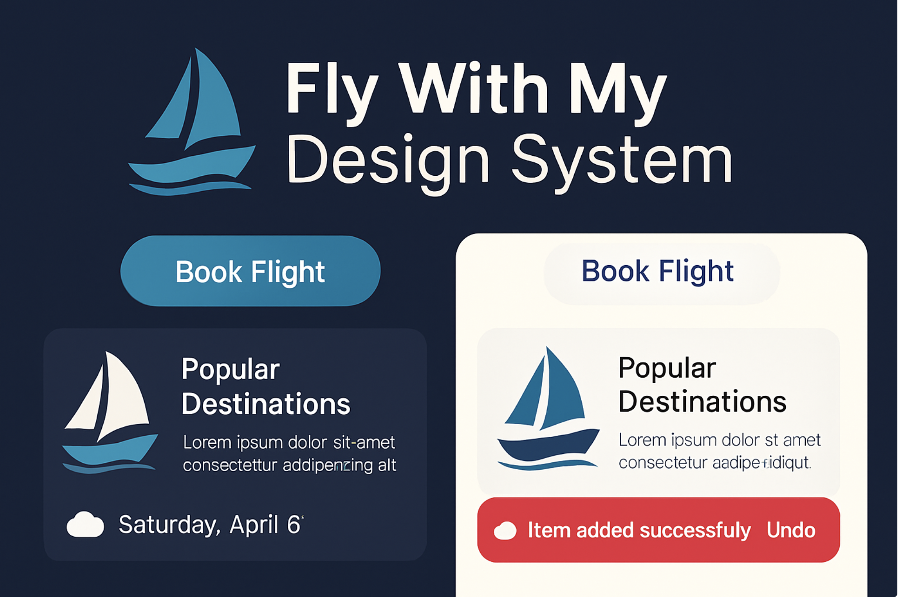

# 🎨 FlyWithMySystemDesign – Design System in Jetpack Compose



**FlyWithMySystemDesign** is a modular and complete **Design System for Android**, built using **Jetpack Compose Material3**.

It provides **ready-to-use UI components, design tokens (color, typography, spacing, shape, elevation), custom icons, animations**, and **Material You dynamic theming** – all designed for scalability, consistency, and performance.

---

## ✨ Features

### 🎛️ Design Tokens
- `AppColors` – Light & Dark palettes
- `AppTypography` – H1–H6, Body, Label, Display
- `AppShape` – small, medium, large
- `AppSpacing` – xs, sm, md, lg, xl, xxl
- `AppElevation` – none, small, medium, large
- `AppAnimations` – fade, scale, slide

### 🧩 Components
- **Buttons:**  
  `AppButton`, `AppOutlinedButton`, `AppTextButton`, `AppElevatedButton`

- **FABs:**  
  `AppFab`, `AppExtendedFab`

- **Cards:**  
  `AppCard`

- **Chips:**  
  `AppTagChip`, `AppAssistChip`

- **Form Elements:**  
  `AppRadio`, `AppCheckbox`, `AppSwitch`

- **UI States:**  
  `AppLoadingState`, `AppErrorState`, `AppEmptyState`, `AppSuccessState`

- **Others:**  
  `AppTooltip`, `AppSnackbar`, `AppBottomSheet`, `AppScaffold`, `AppToolbar`, `AppBottomBar`

### 🎨 Custom Icons
- `AppIcons` – Filled, Outlined, Rounded (via `material-icons-extended`)
- Custom vectors using `ImageVector.vectorResource`

### 🌗 Themes
- `AppDynamicTheme` – Supports **Material You** (Dynamic Color) on Android 12+
- Light and Dark fallback with full token integration

### 🎞️ Animations
- Built-in: `fadeInOut`, `scaleInOut`
- Easily extendable with custom transitions for user interaction

---

## 📦 Installation

Add the dependencies to your `build.gradle` (Module):

```gradle
implementation "androidx.compose.material3:material3:<version>"
implementation "androidx.compose.material:material-icons-extended:<version>"
```